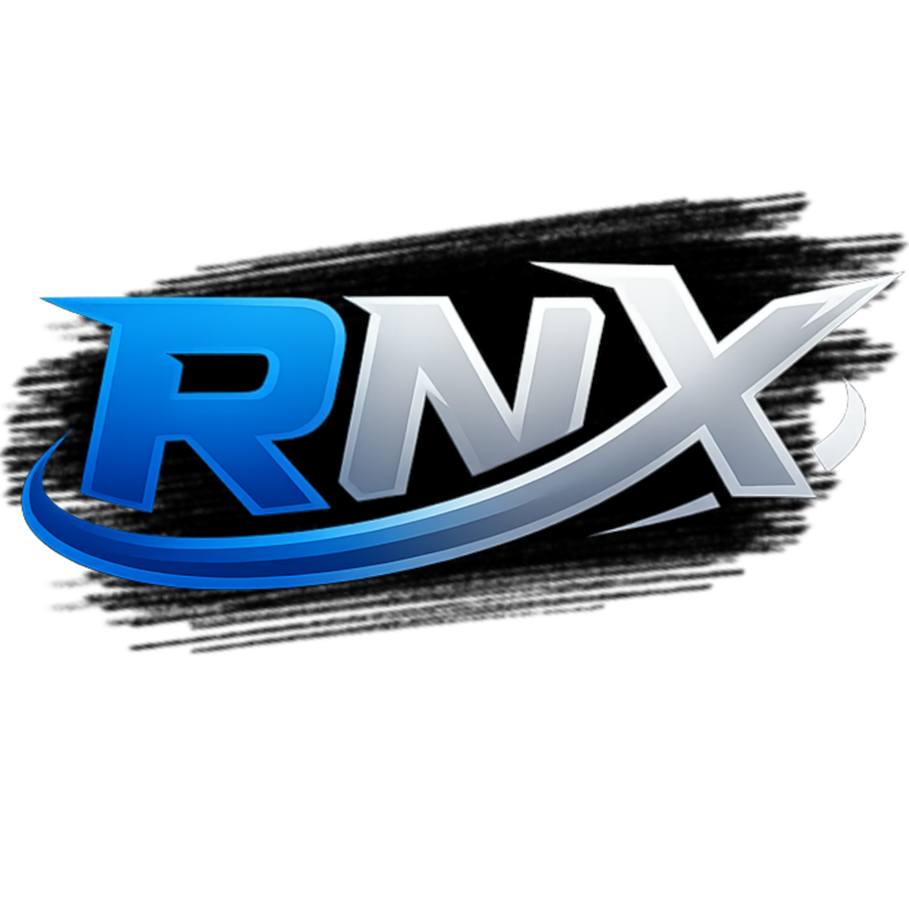



Komplettlösung für Discord Rich Presence auf der Nintendo Switch.


Das Projekt besteht aus zwei Teilen:

1. **Switch-Sysmodule** (liefert Telemetrie als HTTP-JSON)
2. **Windows-Client (RichNX)** (pollt `/state` und setzt Discord RPC)

---

## Inhaltsverzeichnis

- [Projektaufbau](#projektaufbau)
- [End-to-End Datenfluss](#end-to-end-datenfluss)
- [Switch-Sysmodule](#switch-sysmodule)
- [Windows-Client (RichNX)](#windows-client-richnx)
- [Build & Publish](#build--publish)
- [Troubleshooting](#troubleshooting)
- [Author & Repository](#author--repository)

---

## End-to-End Datenfluss

1. Das Sysmodule läuft auf der Switch
2. Das Sysmodule stellt HTTP-Endpunkte bereit (`/state`, `/debug`)
3. Der Windows-Client ruft zyklisch `http://<Switch-IP>:<Port>/state` ab
4. Der Client löst Titel/Icons auf (lokale Titel + TitleDB)
5. Der Client setzt Discord Rich Presence über IPC (`discord-ipc-0..9`)

---

## Switch-Sysmodule

### Aufgaben

- sammelt Telemetrie (Firmware, aktives Spiel, Program-ID, Zeitwerte)
- aktualisiert Daten zyklisch
- hostet Telemetrie als JSON über HTTP
- schreibt Debug-Log nach `sdmc:/switch/switch-dcrpc/log.log`

### HTTP API

- `GET /state`
- `GET /debug`

Beispiel (`/state`):

```json
{
  "service": "RichNX",
  "firmware": "21.2.0",
  "active_program_id": "0x01006F8002326000",
  "active_game": "Animal Crossing New Horizons",
  "battery_percent": 78,
  "is_charging": true,
  "is_docked": true,
  "started_sec": 12,
  "last_update_sec": 20,
  "sample_count": 4,
  "last_pm_result": "0x00000000",
  "last_ns_result": "0x00000000"
}
```

---

## Windows-Client (RichNX)

### Features

- Discord Rich Presence via Discord IPC (`discord-ipc-0..9`)
- Polling von `http://<Switch-IP>:<Port>/state`
- Titelauflösung über lokale Liste + TitleDB-Fallback
- optionale Icons aus TitleDB
- stabilere Session-Zeit pro Spiel
- Akku-Prozent + Ladestatus aus `/state` im RPC-Status
- Docked/Handheld-Status aus `/state` im RPC-Status
- RPC-Clear nach längerer Endpoint-Unerreichbarkeit
- optionaler GitHub-Button im RPC
- Tray-Modus (Close-to-tray, Reopen/Exit über Tray-Icon)
- Single-Instance (zweiter Start fokussiert laufende Instanz)
- persistente Konfiguration

### Standardwerte

- `Switch IP`: `YourSwitchIP`
- `Port`: `6029`
- `RPC Name`: `Playing on Switch`
- `Poll (ms)`: `2000`

### Voraussetzungen

- Windows 10/11
- Discord Desktop App muss laufen
- erreichbarer Switch-Endpoint (`/state`)

### Bedienung

1. `Switch IP` und `Port` eintragen
2. optional `RPC Name` anpassen
3. `Start` klicken
4. Presence in Discord prüfen

### Settings (Menü)

- `Autostart with Windows`
- `Connect on startup`
- `Show GitHub button in RPC`
- `Show battery status in RPC`

Zusätzlich:

- About-Dialog mit Version, Author und klickbarem Repository-Link

### Tray-Verhalten

- Minimieren versteckt das Fenster im Tray
- Klick auf `X` beendet nicht sofort, sondern versteckt in den Tray
- beim Verstecken über `X` erscheint ein Hinweis:
  - `RichNX is still running`
- Tray-Menü:
  - `Open`
  - `Exit`

### Single-Instance Verhalten

- Nur eine Instanz kann laufen
- Zweiter Start der EXE aktiviert/fokussiert das vorhandene Fenster

### Konfiguration

#### Speicherort

- Publish-Ausgabe: `windows-client/dist/win-x64/DB/config.json`
- Build-Ausgabe: `windows-client/src/SwitchDcrpc.Wpf/bin/<Config>/net10.0-windows/DB/config.json`

#### Gespeicherte Felder

- `SwitchIp`
- `Port`
- `RpcName`
- `PollIntervalMs`
- `TitleDbPack`
- `ConnectOnStartup`
- `StartWithWindows`
- `ShowGithubButton`

### Autostart (Registry)

Wenn aktiviert, schreibt der Client:

- Key: `HKCU\Software\Microsoft\Windows\CurrentVersion\Run`
- Value-Name: `RichNX`
- Value: Pfad zur EXE

Hinweis: nur `HKCU` (kein `HKLM`, keine Admin-Rechte erforderlich).

---

## Build & Publish

### Windows-Client Build

```powershell
dotnet build .\windows-client\src\SwitchDcrpc.Wpf\SwitchDcrpc.Wpf.csproj -c Release
```

### Windows-Client Publish (Single EXE)

```powershell
dotnet publish .\windows-client\src\SwitchDcrpc.Wpf\SwitchDcrpc.Wpf.csproj -c Release -r win-x64 --self-contained true -p:PublishSingleFile=true -p:IncludeNativeLibrariesForSelfExtract=true -p:EnableCompressionInSingleFile=true -p:DebugType=None -p:DebugSymbols=false -o .\windows-client\dist\win-x64
```

Ausgabe:

- `windows-client/dist/win-x64/RichNX.exe`

---

## Troubleshooting

- **Discord not connected**
  - Discord Desktop starten bzw. neu starten
- **Switch endpoint unreachable**
  - IP/Port prüfen, `/state` im Browser testen
- **RPC wird nach Verbindungsproblemen gelöscht**
  - gewolltes Verhalten nach längerer Unerreichbarkeit
- **Autostart greift nicht**
  - Setting erneut setzen und `HKCU\...\Run` prüfen
- **VirusTotal 1/70 Treffer**
  - häufig Heuristik/False Positive bei Single-File + Self-Extract + unsignierter EXE

---

## Author & Repository

- Author: **Cracky**
- Repository: https://github.com/Cracky0001/RichNX

---

## Lizenz

GPL-3.0 license


